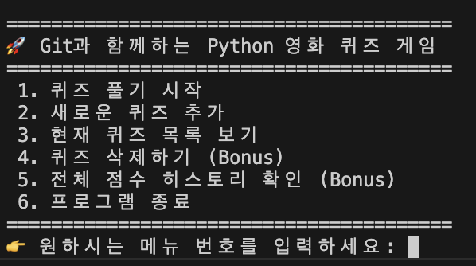
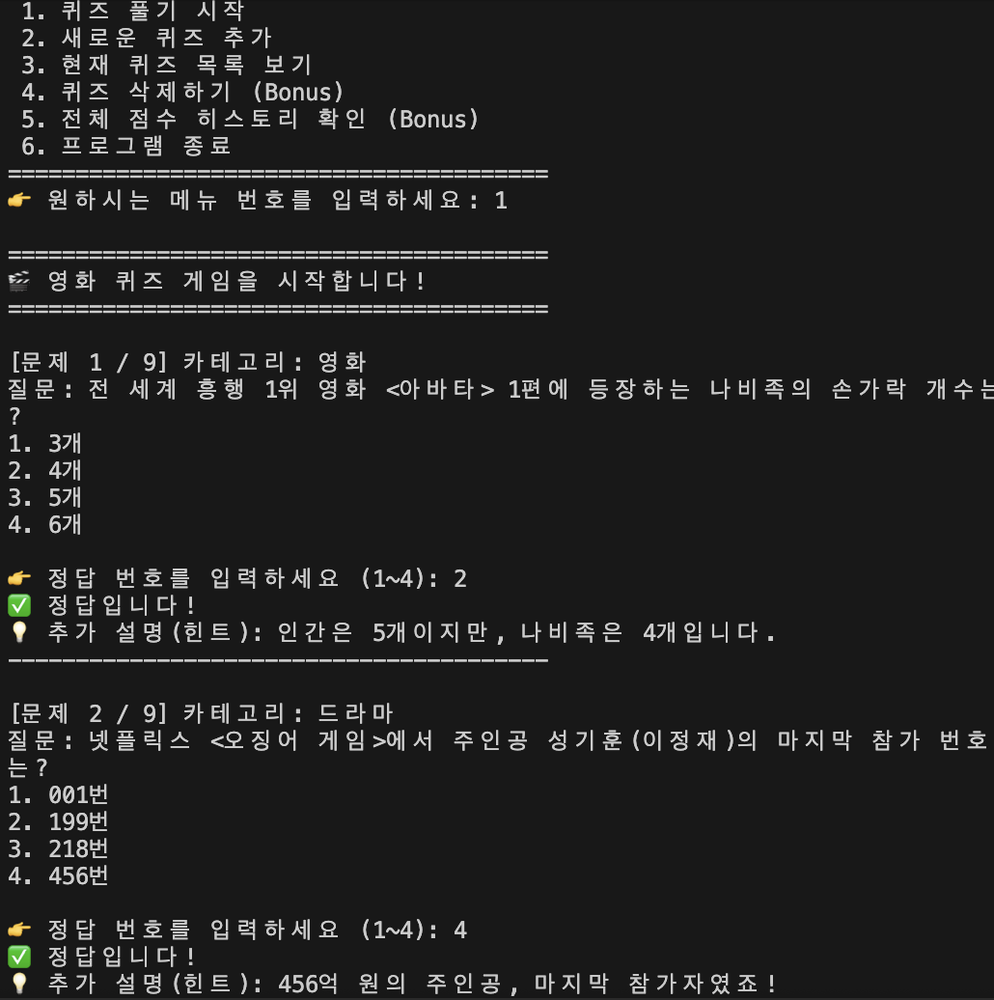
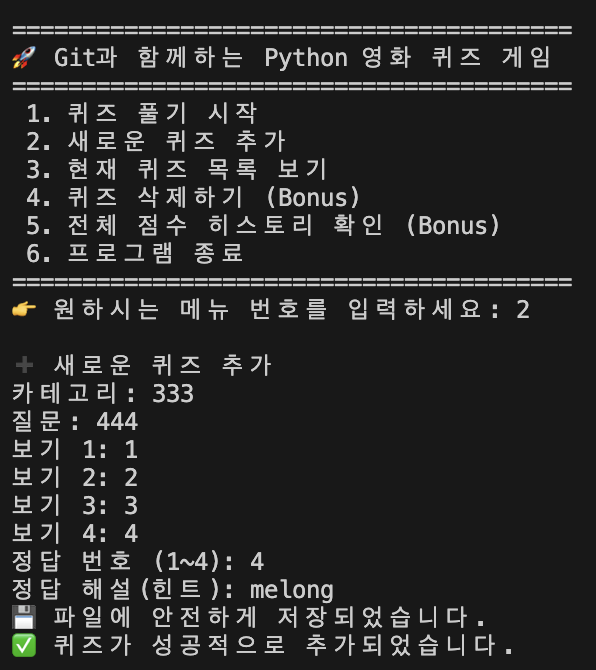
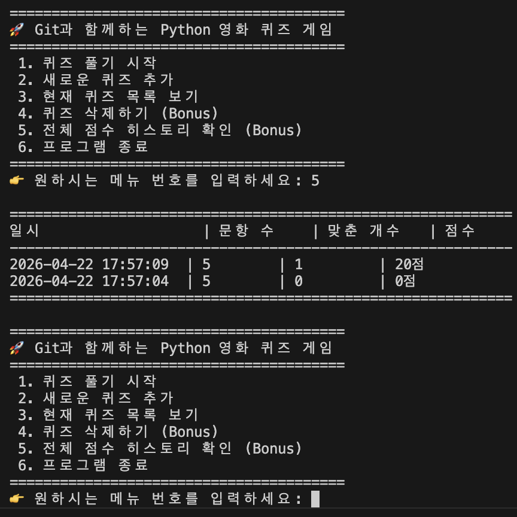
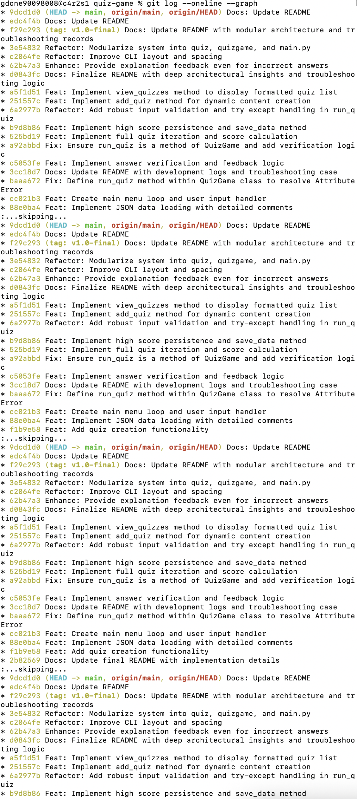
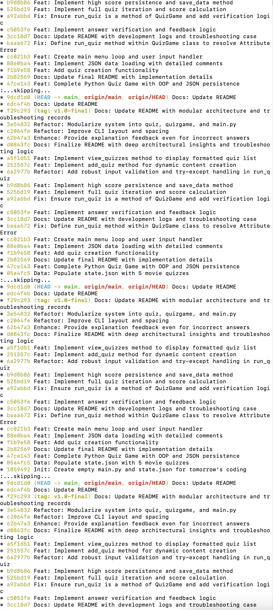
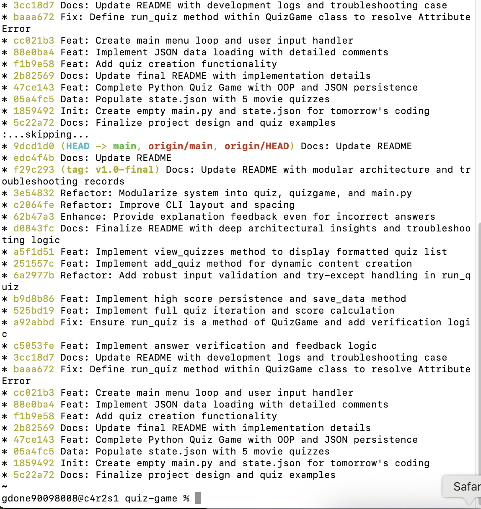

# 🎯 Quiz Game

# 🚀 Git과 함께하는 Python 첫 발자국 (Codyssey-E1-2)

## 1. 프로젝트 개요
본 프로젝트는 파이썬의 객체지향 프로그래밍(OOP) 원리와 JSON 데이터 처리를 학습하기 위한 CLI 기반 퀴즈 시스템입니다. 코드의 동작뿐만 아니라 설계 의도와 단계별 문제 해결 과정을 기록하는 데 중점을 둡니다.

### 퀴즈 주제 선정 이유
* **주제**: 영화 & 시리즈 상식
* **선정 이유**: 선정 이유: 사용자가 1~4 사이의 숫자를 입력하는 직관적인 UX를 제공하며, 정답 시 제공되는 부연 설명을 통해 재미와 정보를 동시에 전달합니다.
* **주요 콘텐츠**: <아바타>, <오징어 게임>, <어벤져스>, <007>, <해리포터> 등 대중적인 영화 및 드라마 상식 5문항.

## 2. 실행 환경 / 기술 스택
언어: Python 3.x
데이터: JSON (데이터 영속성 확보)
버전 관리: Git (단계별 커밋 및 브랜치 전략)
 Feat: 기능 추가 | Fix: 버그 수정 | Refactor: 구조 개선 | Docs: 문서 수정

## 3. 현재 진행 상황 / 수행 체크리스트 (Milestones)
본 프로젝트는 설계부터 배포까지 마일스톤을 설정하여 진행되었습니다.

[x] 1단계: 프로젝트 구조 및 JSON 데이터 설계
  [x] 프로젝트 폴더 구조 및 파일 역할 정의 (main, quiz, state)
  [x] state.json 스키마 설계 (id, question, options, answer, description)

[x] 2단계: 데이터 핸들링 및 영속성 구현
  [x] json 라이브러리를 이용한 데이터 역직렬화(Load) 및 직렬화(Save)
  [x] 파일 미존재 시 기본 데이터 생성 로직(Fail-safe) 구축

[x] 3단계: 객체지향 리팩토링 및 모듈화
  [x] 단일 파일 구조에서 Model-Controller-View로 관심사 분리(SoC)
  [x] Quiz 클래스 및 QuizGame 클래스 캡슐화

[x] 4단계: 견고한 UX 및 예외 처리
  [x] while True 이벤트 루프 기반의 CLI 메뉴 시스템 구축
  [x] try-except를 활용한 사용자 입력 유효성 검사 및 정규화

[x] 5단계: 버전 관리 및 문서화
  [x] Git 브랜치 전략 기반의 기능 단위 개발 및 병합(Merge)
  [x] 단계별 트러블슈팅 기록 및 기술 문서(README.md) 완성

## 4. 📂 프로젝트 구조 (파일 구조)
```Plaintext
.
├── README.md          # 프로젝트 전체 가이드 및 설계도
├── main.py            # 프로그램 진입점 (Menu Loop)
├── quiz.py            # Quiz 데이터 모델 클래스
├── quizgame.py        # 게임 운영 및 데이터 관리 클래스
└── state.json         # 데이터 영속성 저장소 (퀴즈 및 최고 점수)
```

### 📊 데이터 구조 (state.json)
데이터는 확장성을 고려하여 아래와 같은 JSON 구조로 설계되었습니다.

```json
{
  "high_score": 100,
  "quizzes": [
    {
      "id": 1,
      "question": "나비족의 손가락 개수는?",
      "options": ["3개", "4개", "5개", "6개"],
      "answer": 2,
      "description": "인간은 5개이지만, 나비족은 4개입니다."
    }
  ]
}
```

## 5. 🛠️ 핵심 기능 및 구현 디테일
### 5-1. 방어적 프로그래밍 (Robustness)
입력 정규화: input().strip()을 통해 의도치 않은 공백 입력을 제거하여 판정 오류를 방지합니다.

예외 처리: try-except와 while 루프를 결합하여 문자가 입력되거나 범위를 벗어난 숫자가 입력되어도 프로그램이 중단되지 않고 재입력을 유도합니다.

복구 로직 (Fail-safe): state.json이 없거나 손상된 경우, set_default_data()를 통해 기본 퀴즈 5종을 자동 생성하여 시스템을 복구합니다.

### 5-2. 데이터 영속성 (Persistence)
프로그램 종료 시 save_data()를 호출하여 최고 점수와 추가된 퀴즈를 JSON으로 **직렬화(Serialization)**합니다.

재시작 시 이를 **역직렬화(Deserialization)**하여 이전 상태를 완벽히 복원합니다.

## 6. 실행 방법
아이맥 터미널에서 프로젝트 폴더로 이동한 후 아래 명령어를 입력하세요.
```bash
python main.py

```

아이맥 터미널을 열고 프로젝트 폴더(~/Workspace/quiz-game)로 이동한 후 아래 명령어를 입력하세요.

Bash
python main.py

## 7. 핵심 기능 목록
[x] 퀴즈 풀기: 저장된 문제 중 5문제를 출제하고 정답 여부 실시간 확인
[x] 퀴즈 추가: 사용자가 새로운 문제와 정답 번호를 입력하여 시스템에 반영
[x] 목록 보기: 현재 저장된 모든 퀴즈 리스트(질문/보기) 확인
[x] 점수 및 기록: 퀴즈 종료 후 점수 계산 및 최고 점수(High Score) 자동 갱신
[x] 즉각적인 학습 피드백: 정답/오답 여부와 관계없이 상세 해설을 제공하여 사용자에게 유의미한 정보 전달.

객체지향 설계 (QuizGame 클래스): 데이터 로드, 퀴즈 실행, 결과 저장 로직을 하나의 클래스로 캡슐화하여 유지보수성을 높였습니다.

데이터 영속성 (JSON): state.json 파일을 사용하여 프로그램 종료 후에도 **최고 점수(High Score)**가 유지되도록 구현했습니다.
json.dump와 json.load를 통해 프로그램 종료 후에도 상태를 유지함.

방어적 프로그래밍: os.path.exists와 try-except를 사용해 파일 누락이나 손상에 대응함.

캡슐화: 모든 데이터 관리 기능을 QuizGame 클래스 내부에 격리하여 main.py의 복잡도를 낮춤.

예외 처리: 사용자가 숫자가 아닌 값을 입력할 경우 프로그램이 강제 종료되지 않도록 try-except 구문을 적용했습니다.

동적 UI: 퀴즈의 총 문항 수와 점수를 실시간으로 계산하여 출력합니다.

## 8. 🖥️ 실행 예시 (퀴즈 풀기)


```Plaintext
[문제 1]
전 세계 흥행 1위 영화 <아바타> 1편에 등장하는 나비족의 손가락 개수는?

1. 3개
2. 4개
3. 5개
4. 6개

정답 입력: 2
✅ 정답입니다! (인간은 5개이지만, 나비족은 4개입니다.)

----------------------------------------

[문제 2]
넷플릭스 <오징어 게임>에서 주인공 성기훈(이정재)의 마지막 참가 번호는?

1. 001번
2. 199번
3. 218번
4. 456번

정답 입력: 4
✅ 정답입니다! (456억 원의 주인공, 마지막 참가자였죠!)

----------------------------------------

[문제 3]
영화 <어벤져스: 엔드게임>의 명대사 "나는 너를 ____만큼 사랑해"에 들어갈 숫자는?

1. 100
2. 1000
3. 3000
4. 5000

정답 입력: 3
✅ 정답입니다! (아이언맨의 희생과 사랑을 상징하는 숫자입니다.)

----------------------------------------

[문제 4]
영국 첩보원 제임스 본드(007 시리즈)가 부여받은 살인면허 번호는?

1. 001
2. 003
3. 007
4. 009

정답 입력: 3
✅ 정답입니다! (이름보다 유명한 제임스 본드의 코드네임입니다.)

----------------------------------------

[문제 5]
영화 <해리포터>에서 호그와트행 열차를 타기 위한 승강장 번호는?

1. 9와 1/4
2. 9와 2/4
3. 9와 3/4
4. 10번

정답 입력: 3
✅ 정답입니다! (9번과 10번 승강장 사이 벽으로 뛰어드세요!)

========================================
🏆 결과: 5문제 중 5문제 정답! (100점)
🎉 축하합니다! 만점입니다!
========================================
```


## 🛠️ 9 단계별 개발 기록 (Development Log)

[1단계] 프로젝트 초기화 및 기초 데이터 설계
내용: 프로젝트 폴더 구조를 잡고 퀴즈 데이터의 표준 형식을 state.json에 정의함.

설계 의도: 데이터와 로직을 분리하여 유지보수성을 높이고, 프로그램 실행에 필요한 최소한의 구조를 선언함.

[2단계] 데이터 로드 기능 구현 (Data Persistence)
내용: json 및 os 라이브러리를 활용하여 외부 파일을 읽어 파이썬 객체로 변환하는 로직 구현.

핵심 원리:

os.path.exists: 파일 미존재 시 에러를 방지하는 방어적 프로그래밍.

json.load(): 텍스트 데이터를 파이썬 딕셔너리로 **역직렬화(Deserialization)**하여 처리 효율 극대화.

[3단계] 메인 메뉴 및 이벤트 루프 구축
내용: while True 루프를 통한 CLI 메뉴 시스템 구현.

설계 의도: 사용자가 '종료'를 선택하기 전까지 지속적으로 상호작용하는 이벤트 루프 구조를 설계하고, 메뉴 이외의 입력에 대한 예외 처리를 수행함.

[4단계] 단일 문제 출력 및 UI 설계
내용: 클래스 내 run_quiz 메서드를 정의하여 첫 번째 퀴즈의 질문과 보기를 화면에 렌더링함.

사용자 경험(UX) 고려:

enumerate(list, 1)을 사용하여 내부 인덱스(0)와 사용자 번호(1)를 매핑함.

.get() 메서드를 활용하여 데이터 누락 시에도 프로그램 안정성 유지.


[12단계] 모듈화 및 관심사 분리(SoC) 강화

내용: 단일 파일(main.py) 구조를 quiz.py, quizgame.py, main.py의 3개 모듈로 분리.

이유:

가독성 증대: 각 파일이 100라인 이내의 명확한 역할만 수행하도록 함.

재사용성: Quiz 클래스나 QuizGame 로직을 다른 프로젝트에서도 쉽게 import 하여 쓸 수 있도록 구조화함.

협업 용이성: 여러 개발자가 동시에 작업할 때 발생할 수 있는 코드 충돌(Merge Conflict) 영역을 최소화함.


### 9. 프로젝트 구조 리팩토링 (모듈화 설계)
초기 단일 파일(main.py) 구조에서 객체지향 설계 원칙에 따라 **관심사 분리(Separation of Concerns)**를 실천하기 위해 3개의 모듈로 리팩토링을 단행했습니다.

📁 파일 구성 및 역할
quiz.py (Model): 퀴즈 데이터의 구조를 정의하는 Quiz 클래스를 담고 있습니다. 데이터의 정답 여부를 판별하는 비즈니스 로직을 포함합니다.

quizgame.py (Controller): 전체 게임의 흐름을 제어하는 QuizGame 클래스를 담고 있습니다. JSON 파일 입출력(직렬화/역직렬화)과 점수 관리, 퀴즈 추가/목록 보기 기능을 수행합니다.

main.py (View/Entry Point): 프로그램의 진입점입니다. 사용자 인터페이스(CLI 메뉴)를 출력하고 사용자의 입력에 따라 컨트롤러를 호출합니다.

### 🌿 10. Git 브랜치 전략 및 워크플로우
본 프로젝트는 안정적인 개발을 위해 Git 브랜치를 적극적으로 활용하였습니다.

main 브랜치: 배포 가능한 상태의 안정적인 코드를 관리합니다.

feat/refactor-modules 브랜치: 모듈화 리팩토링을 위해 독립적인 실험 환경에서 작업을 진행했습니다.

작업 흐름:

새로운 기능 구현 전 전용 브랜치 생성 (git checkout -b)

기능 단위별 세밀한 커밋 기록 유지

로컬 테스트 완료 후 main 브랜치로 병합 (git merge)


## 🔍 11. 트러블슈팅 (Troubleshooting Record)

사례 1: AttributeError (들여쓰기 오류)
현상: QuizGame 객체에서 메서드를 찾을 수 없다는 에러 발생.

원인: 파이썬 인덴트 규칙 미준수로 메서드가 클래스 외부로 독립됨.

해결: 클래스 내부로 들여쓰기를 조정하여 캡슐화 완료. 파이썬에서 들여쓰기는 단순 가독성이 아닌 논리적 구조임을 재확인.

🚨 사례 2: TypeError (가변 인자 언패킹 이슈)
현상: JSON 데이터를 Quiz 객체로 변환할 때 인자 개수 불일치 에러 발생.

원인: **q 언패킹 시 클래스 생성자가 고정된 인자만 받도록 설계됨.

해결: def __init__(self, **kwargs): 형태로 생성자를 개선하여 데이터 확장성 확보.

🚨 사례 3: ModuleNotFoundError (파일명 오타)
현상: 리팩토링 후 import 실패.

원인: guizgame.py로 파일명 오타 발생.

해결: mv guizgame.py quizgame.py 명령어로 표준 명명 규칙 적용.

## 12. 기술적 성과 요약
객체지향 설계: 클래스 간 상호작용 및 데이터 캡슐화 성공.

재현 가능성(Reproducibility): 상대 경로 및 예외 처리를 통해 어떤 환경에서도 즉시 실행 가능.

관심사 분리: 로직-데이터-인터페이스의 명확한 역할 분담.


## 🖥️ 실행 화면 스크린샷

프로그램의 주요 실행 화면은 다음과 같습니다. (상세 이미지 파일은 `docs/screenshots/` 폴더 내에 저장되어 있습니다.)

### 1. 메인 메뉴 및 데이터 로딩

> **설명**: 프로그램 시작 시 JSON 데이터를 로드하고 6가지 메뉴를 출력합니다.

### 2. 퀴즈 플레이 화면

> **설명**: 문제 출력, 사용자 입력 유효성 검사, 정답 피드백 및 힌트 노출 과정을 보여줍니다.

### 3. 새로운 퀴즈 추가

> **설명**: 사용자로부터 카테고리, 질문, 보기, 정답, 해설을 입력받아 `state.json`에 영구 저장합니다.

### 4. 최종 결과 및 히스토리 확인

> **설명**: 퀴즈 종료 후 최종 점수 산출 및 누적된 게임 기록(Bonus)을 확인할 수 있습니다.






